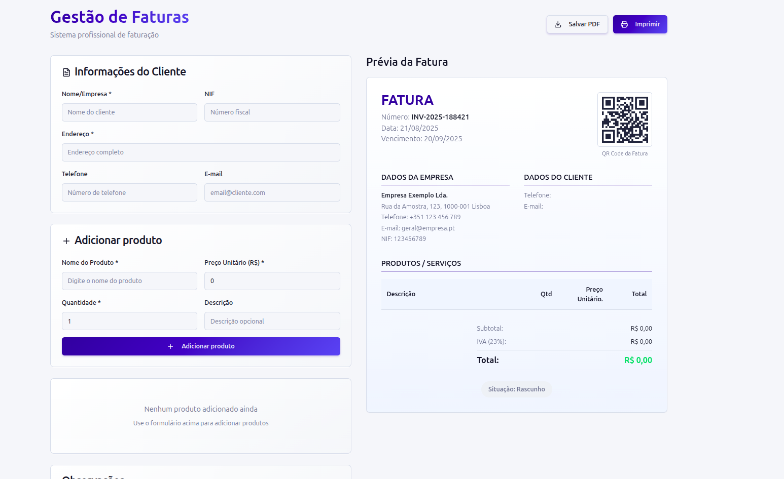
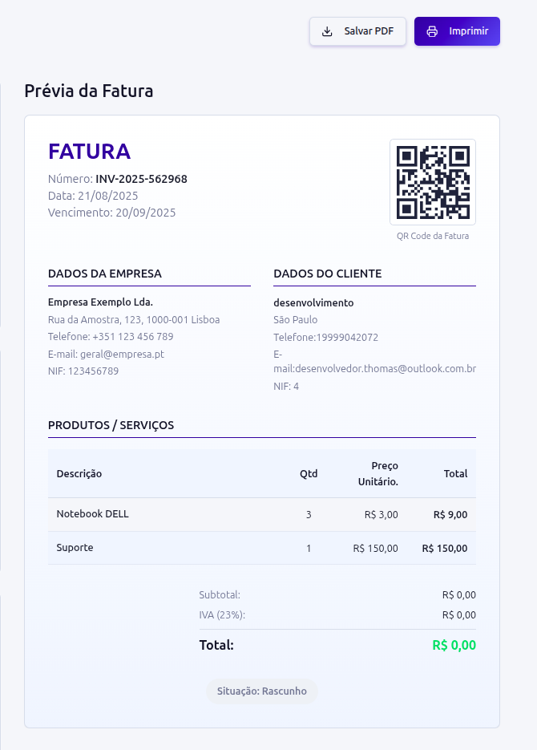

# 📄 Sistema de Gestão de Faturas

## 🧾 Sobre o Projeto
O **Sistema de Gestão de Faturas** é uma aplicação web desenvolvida em **React** que permite gerar, visualizar e gerenciar faturas de forma eficiente.  
A interface moderna e responsiva garante uma experiência fluida, tornando o processo de emissão de faturas rápido e organizado.  

---

## ✨ Funcionalidades
- **Visualização de Fatura:** Prévia detalhada da fatura com todos os itens e valores.  
- **Gerenciamento de Produtos:** Adicione, edite ou remova produtos facilmente.  
- **Cálculo Automático do Total:** Atualização automática do valor total da fatura com base em quantidade e preço.  
- **QR Code:** Gera QR Code para referência rápida da fatura.  
- **Impressão e PDF:** Permite imprimir ou exportar a fatura em PDF usando **React-to-Print**.  
- **Interface Responsiva:** Layout adaptável para desktops, tablets e dispositivos móveis.  

---
## Print


--

## 🛠 Tecnologias
- **React.js**  
- **JavaScript (ES6+)**  
- **CSS / Tailwind**  
- **React-to-Print**  
- **Bibliotecas adicionais para UI e QR Code**  

---

## 📂 Estrutura do Projeto
```

src/
├── components/   # Componentes reutilizáveis (Fatura, Produto, Botões, etc.)
├── pages/        # Páginas principais do sistema
├── utils/        # Funções auxiliares e cálculos
├── App.js        # Componente raiz
└── index.js      # Ponto de entrada da aplicação

````

---

## 📥 Instalação e Uso
Clone o repositório:

```bash
git clone https://github.com/seu_usuario/invoice-management.git
cd invoice-management
````

Instale as dependências:

```bash
npm install
```

Inicie o servidor de desenvolvimento:

```bash
npm run dev
```

Abra em [http://localhost:5173](http://localhost:5173) (Vite padrão).

---

## 🚀 Como Utilizar

1. Abra a aplicação no navegador.
2. Adicione produtos à fatura com preço e quantidade.
3. Visualize a fatura em tempo real e veja o total atualizado.
4. Gere o QR Code para referência rápida.
5. Imprima ou exporte a fatura em PDF conforme necessário.

---

## 🤝 Contribuição

Contribuições são bem-vindas!
Abra uma **issue** ou envie um **pull request** com sugestões de melhorias ou novos recursos.

---